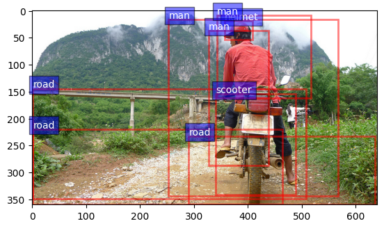

# Filter the CoCo dataset

Given the CoCo annotations and CoCo entities, we filter the CoCo annotations that contain all caption-entities recorded in the CoCo entities.

- Filtered train samples: 
    - #Image: 545224 out of 566747.
    - #Caption: 545224 out of 566747.
- Filtered val samples: 
    - #Image: 4269 out of 5000.
    - #Caption: 21345 out of 25010.
- Filtered test samples: 
    - #Image: 4223 out of 5000.
    - #Caption: 21115 out of 25010.

## Build the Dataset

- To filter the CoCo annotations and CoCo entities, please refer to this [script](./filter_coco_ann_entities.py).
- The filtered CoCo annotations, entities and ground truth are stored in `annotations`, `entities` and `ground_truth` respectively, as shown below.

```
save_path/
├── [ 115]  annotations
│   ├── [1.5M]  coco_karpathy_test.json
│   ├── [ 75M]  coco_karpathy_train.json
│   └── [1.5M]  coco_karpathy_val.json
├── [ 115]  entities
│   ├── [ 14M]  coco_entities_test.json
│   ├── [372M]  coco_entities_train.json
│   └── [ 15M]  coco_entities_val.json
|-- [  85]  ground_truth
|   |-- [2.1M]  coco_karpathy_test_gt.json
|   `-- [2.1M]  coco_karpathy_val_gt.json
└── [7.7K]  filter_coco_ann_entities.py
```

## Data Example

- Here is a [overview](./notebooks/Overview.ipynb) and [data analysis](./notebooks/Data_Analysis.ipynb) of the dataset.  We provide move image examples in the [this notebook](./notebooks/Examples.ipynb).



- The annotations file are keeping the same format as the original CoCo annotations, here is an example from the `annotations/coco_karpathy_test.json`:

    ```
    [
        {
            "image": "val2014/COCO_val2014_000000391895.jpg",
            "caption": [
                "A man with a red helmet on a small moped on a dirt road. ",
                "Man riding a motor bike on a dirt road on the countryside.",
                "A man riding on the back of a motorcycle.",
                "A dirt path with a young person on a motor bike rests to the foreground of a verdant area with a bridge and a background of cloud-wreathed mountains. ",
                "A man in a red shirt and a red hat is on a motorcycle on a hill side."
            ],
        },
        ...
    ]
    ```

- The entities file are aligned with the annotations file, where each line is a json object, where the key is the original caption from CoCo Caption, and the "det_caption" is the processed caption of CoCo Entities. You may need "det_caption" to trace back the "noun_chunks". Here is an example from the `entities/coco_entities_test.json`:

    ```
    [
        {
            "A man with a red helmet on a small moped on a dirt road. ": {
                "det_caption": "a man with a red helmet on a small moped on a dirt road",
                "det_sequences": ["man", "man", null, "helmet", "helmet", "helmet", null, "scooter", "scooter", "scooter", null, "road", "road", "road"], 
                "noun_chunks": [["a man", "man"], ["a red helmet", "helmet"], ["a small moped", "scooter"], ["a dirt road", "road"]], 
                "detections": {"helmet": [[1, [356.58184814453125, 18.550844192504883, 408.2525329589844, 52.708404541015625]]], "road": [[5, [0.0, 144.3165740966797, 508.1893615722656, 348.3342590332031]], [11, [0.0, 219.1959991455078, 464.52459716796875, 359.0400085449219]], [27, [290.2463684082031, 232.09530639648438, 635.9448852539062, 359.0400085449219]]], "man": [[0, [252.83302307128906, 16.4637393951416, 567.1384887695312, 343.1918029785156]], [8, [327.0209045410156, 36.891990661621094, 438.28790283203125, 287.018310546875]], [32, [341.9764709472656, 8.20772933959961, 516.65283203125, 161.52911376953125]]], "scooter": [[2, [340.62860107421875, 154.61856079101562, 488.52593994140625, 341.0757141113281]]]}, 
                "split": "test"}, 
            "Man riding a motor bike on a dirt road on the countryside.": {
                "det_caption": "man riding a motor bike on a dirt road on the countryside",
                "det_sequences": ["man", null, "bike", "bike", "bike", null, "road", "road", "road", null, "_", "_"], 
                "noun_chunks": [["man", "man"], ["a motor bike", "bike"], ["a dirt road", "road"], ["the countryside", "_"]], 
                "detections": {"road": [[5, [0.0, 144.3165740966797, 508.1893615722656, 348.3342590332031]], [11, [0.0, 219.1959991455078, 464.52459716796875, 359.0400085449219]], [27, [290.2463684082031, 232.09530639648438, 635.9448852539062, 359.0400085449219]]], "man": [[0, [252.83302307128906, 16.4637393951416, 567.1384887695312, 343.1918029785156]], [8, [327.0209045410156, 36.891990661621094, 438.28790283203125, 287.018310546875]], [32, [341.9764709472656, 8.20772933959961, 516.65283203125, 161.52911376953125]]], "bike": [[16, [361.1448059082031, 154.01596069335938, 529.5758056640625, 330.5867919921875]]]}, 
                "split": "test"}, 
            "A man riding on the back of a motorcycle.": {
                "det_caption": "a man riding on the back of a motorcycle",
                "det_sequences": ["man", "man", null, null, "_", "_", null, "motorcycle", "motorcycle"], 
                "noun_chunks": [["a man", "man"], ["the back", "_"], ["a motorcycle", "motorcycle"]], 
                "detections": {"motorcycle": [[35, [347.55078125, 169.78025817871094, 459.1430358886719, 349.263916015625]]], "man": [[0, [252.83302307128906, 16.4637393951416, 567.1384887695312, 343.1918029785156]], [8, [327.0209045410156, 36.891990661621094, 438.28790283203125, 287.018310546875]], [32, [341.9764709472656, 8.20772933959961, 516.65283203125, 161.52911376953125]]]}, 
                "split": "test"}, 
            "A dirt path with a young person on a motor bike rests to the foreground of a verdant area with a bridge and a background of cloud-wreathed mountains. ": {
                "det_caption": "a dirt path with a young person on a motor bike rests to the foreground of a verdant area with a bridge and a background of cloudwreathed mountains",
                "det_sequences": ["_", "_", "_", null, "people", "people", "people", null, "bike", "bike", "bike", null, null, "_", "_", null, "_", "_", "_", null, "bridge", "bridge", null, "_", "_", null, "mountain", "mountain"], 
                "noun_chunks": [["a dirt path", "_"], ["a young person", "people"], ["a motor bike", "bike"], ["the foreground", "_"], ["a verdant area", "_"], ["a bridge", "bridge"], ["a background", "_"], ["cloudwreathed mountains", "mountain"]], 
                "detections": {"people": [[29, [469.3617858886719, 169.0027313232422, 506.923583984375, 229.41781616210938]]], "bridge": [[19, [35.663761138916016, 152.99452209472656, 281.43890380859375, 191.66477966308594]], [28, [0.0, 129.76185607910156, 361.2510070800781, 222.19334411621094]], [36, [31.07439422607422, 141.52244567871094, 347.25811767578125, 169.14915466308594]]], "mountain": [[6, [51.94191360473633, 0.0, 583.7931518554688, 211.15512084960938]], [10, [5.784336090087891, 20.44477081298828, 341.0400695800781, 128.95855712890625]], [12, [281.5927734375, 26.084047317504883, 550.493408203125, 150.44351196289062]], [26, [126.40021514892578, 24.465635299682617, 562.4874267578125, 150.3363800048828]]], "bike": [[16, [361.1448059082031, 154.01596069335938, 529.5758056640625, 330.5867919921875]]]}, 
                "split": "test"}, 
            "A man in a red shirt and a red hat is on a motorcycle on a hill side.": {
                "det_caption": "a man in a red shirt and a red hat is on a motorcycle on a hill side",
                "det_sequences": ["man", "man", null, "shirt", "shirt", "shirt", null, "shirt", "shirt", "shirt", null, null, "motorcycle", "motorcycle", null, "_", "_", "_"], 
                "noun_chunks": [["a man", "man"], ["a red shirt", "shirt"], ["a red hat", "shirt"], ["a motorcycle", "motorcycle"], ["a hill side", "_"]], 
                "detections": {"shirt": [[9, [354.2871398925781, 59.217689514160156, 453.46417236328125, 163.4180908203125]]], "motorcycle": [[35, [347.55078125, 169.78025817871094, 459.1430358886719, 349.263916015625]]], "man": [[0, [252.83302307128906, 16.4637393951416, 567.1384887695312, 343.1918029785156]], [8, [327.0209045410156, 36.891990661621094, 438.28790283203125, 287.018310546875]], [32, [341.9764709472656, 8.20772933959961, 516.65283203125, 161.52911376953125]]]}, 
                "split": "test"}
        },
        ...
    ]
    ```

- The ground truth are aligned with the valid and test annotations file, here is an example from the `ground_truth/coco_karpathy_test_gt.json`:

    ```
    {
        "annotations": [
            {"image_id": 391895, "caption": "A man with a red helmet on a small moped on a dirt road. ", "id": 1}, 
            {"image_id": 391895, "caption": "Man riding a motor bike on a dirt road on the countryside.", "id": 2}, 
            ...
            {"image_id": 74478, "caption": "A man holding a glass speaking to someone", "id": 21115} 
            # 21115 captions in total
        ],
        "images": [
            {"id": 391895}, {"id": 60623}, ... , {"id": 74478}  
            # 4223 images in total 
        ]
    }
    ```
