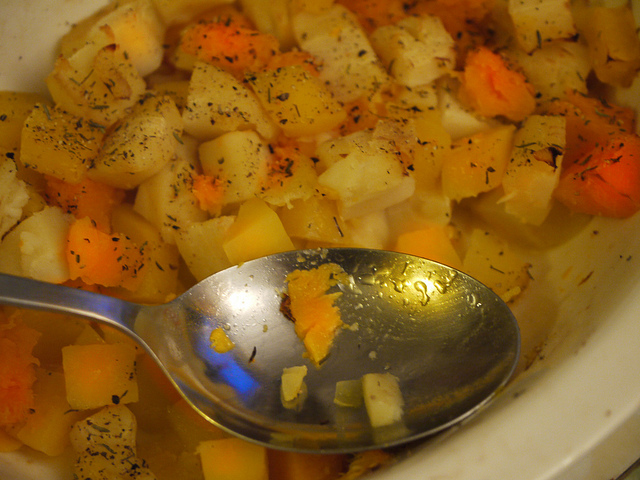

# Formatting CoCo Entities

## Raw Data Examples

<details>
<summary>Click to view the valid example</summary>




```
"520208": {
    "a spoon sitting on some food in a bowl": {
        "det_sequences": ["spoon", "spoon", null, null, "food", "food", null, "bowl", "bowl"], 
        "noun_chunks": [
            ["a spoon", "spoon"], 
            ["some food", "food"], 
            ["a bowl", "bowl"]], 
        "detections": {
            "spoon": [[2, [0.0, 234.5964813232422, 477.697021484375, 479.20001220703125]], [14, [259.7029724121094, 215.28146362304688, 555.7696533203125, 395.4397277832031]]], 
            "food": [[0, [236.583984375, 0.0, 639.2000122070312, 375.694580078125]], [5, [68.67597961425781, 0.0, 542.5230102539062, 302.64239501953125]]], 
            "bowl": [[1, [12.056884765625, 32.955543518066406, 594.0037231445312, 464.70672607421875]]]}, 
        "split": "train"
    }, 
    "a bowl of food and a spoon held up that has eaten food": {
        "det_sequences": ["bowl", "bowl", null, "food", null, "spoon", "spoon", null, null, null, null, null, "food"], 
        "noun_chunks": [
            ["a bowl", "bowl"], 
            ["food", "food"], 
            ["a spoon", "spoon"], 
            ["food", "food"]], 
        "detections": {
            "bowl": [[1, [12.056884765625, 32.955543518066406, 594.0037231445312, 464.70672607421875]]], 
            "food": [[0, [236.583984375, 0.0, 639.2000122070312, 375.694580078125]], [5, [68.67597961425781, 0.0, 542.5230102539062, 302.64239501953125]]], 
            "spoon": [[2, [0.0, 234.5964813232422, 477.697021484375, 479.20001220703125]], [14, [259.7029724121094, 215.28146362304688, 555.7696533203125, 395.4397277832031]]]}, 
        "split": "train"
    }, 
    "a white bowl filled with mixed vegetables and a spoon": {
        "det_sequences": ["bowl", "bowl", "bowl", null, null, "potatoes", "potatoes", null, "spoon", "spoon"], 
        "noun_chunks": [["a white bowl", "bowl"], ["mixed vegetables", "potatoes"], ["a spoon", "spoon"]], "detections": {"bowl": [[1, [12.056884765625, 32.955543518066406, 594.0037231445312, 464.70672607421875]]], "potatoes": [[4, [261.80291748046875, 0.0, 639.2000122070312, 230.02053833007812]], [9, [26.407129287719727, 72.50532531738281, 400.67034912109375, 243.777099609375]]], "spoon": [[2, [0.0, 234.5964813232422, 477.697021484375, 479.20001220703125]], [14, [259.7029724121094, 215.28146362304688, 555.7696533203125, 395.4397277832031]]]}, "split": "train"
    }, 
    "there is a spoons resting in a bowl of food": {
        "det_sequences": [null, null, "spoon", "spoon", null, null, "bowl", "bowl", null, "food"], 
        "noun_chunks": [
            ["a spoons", "spoon"], 
            ["a bowl", "bowl"], 
            ["food", "food"]], 
        "detections": {
            "spoon": [[2, [0.0, 234.5964813232422, 477.697021484375, 479.20001220703125]], [14, [259.7029724121094, 215.28146362304688, 555.7696533203125, 395.4397277832031]]], 
            "food": [[0, [236.583984375, 0.0, 639.2000122070312, 375.694580078125]], [5, [68.67597961425781, 0.0, 542.5230102539062, 302.64239501953125]]], 
            "bowl": [[1, [12.056884765625, 32.955543518066406, 594.0037231445312, 464.70672607421875]]]}, 
        "split": "train"
    }, 
    "a close up of a spoon in a bowl of food": {
        "det_sequences": [null, null, null, null, "spoon", "spoon", null, "bowl", "bowl", null, "food"], 
        "noun_chunks": [
            ["a spoon", "spoon"], 
            ["a bowl", "bowl"], 
            ["food", "food"]], 
        "detections": {
            "spoon": [[2, [0.0, 234.5964813232422, 477.697021484375, 479.20001220703125]], [14, [259.7029724121094, 215.28146362304688, 555.7696533203125, 395.4397277832031]]], 
            "food": [[0, [236.583984375, 0.0, 639.2000122070312, 375.694580078125]], [5, [68.67597961425781, 0.0, 542.5230102539062, 302.64239501953125]]], 
            "bowl": [[1, [12.056884765625, 32.955543518066406, 594.0037231445312, 464.70672607421875]]]}, 
        "split": "train"}
    }
```

</details>

## Raw Data Analysis

We do a [data analysis](./notebooks/data_analysis.ipynb) on the CoCo Entities dataset, here are some statistics:

- Statistics of the CoCo Entities:

    ```
    # train [samples|images|captions]: [544926|113179|544926]
    # val   [samples|images|captions]: [4995|4995|24015]
    # test  [samples|images|captions]: [4995|4995|23940]
    ```

- For reference, the statistics of the  original CoCo Caption has:

    ```
    # train [samples|images|captions]: [566747|113287|566747]
    # val   [samples|images|captions]: [5000|5000|25010]
    # test  [samples|images|captions]: [5000|5000|25010]
    ```

- The difference between CoCo Entities and CoCo Caption:

    ```
    # train images in coco_ann but not in coco_entities: 108
    # train images in coco_entities but not in coco_ann: 0
    # val images in coco_ann but not in coco_entities: 5
    # val images in coco_entities but not in coco_ann: 0
    # test images in coco_ann but not in coco_entities: 5
    # test images in coco_entities but not in coco_ann: 0
    ```

## Processing

We processed the dataset into following format:

```json
[
    {
        "image_id" (int): image_id,
        "image" (str): "image_file_name",    
        "image_size" (list[int]): [width, height, depth],
        "annotations" (list[dict]): [
            {
                "caption" (str): "caption_text",
                "entities" (list[dict]): [
                    {
                        "start_idx": start_idx,         # closed
                        "end_idx": end_idx,             # opened
                        "noun_chunk": "noun_chunk"      # associated noun chunk
                        "entity_tag": ["entity_tag"],   # associated entity tag
                        "box_id": "box_id"              # associated box id
                    }, 
                    ...
                ],
            },
            ... # mulitple annotations for the val/test/val_grouped/test_grouped splits   
        ],
        "boxes":{
            "box_id": [[x_min, y_min, x_max, y_max], ...],
            "box_id": [[x_min, y_min, x_max, y_max], ...],
            ...
        }
    },
    ...
]    
```

### Splits

- CoCo karpathy splits: The original CoCo karpathy splits (`train`, `val`, `test`)
- Grouped splits: Apart from the the original splits, we further add `val_grouped` and  `test_grouped` splits, which are used for the [Show, Control and Tell](https://arxiv.org/abs/1811.10652) task. The `val_grouped` and `test_grouped` splits are filteted and split from the original `val` and `test` split, respectively. Each sample consists of a image and mulit caption-entity pairs **with the same bbox reference sequence**. For more details, please refer to the [Show, Control and Tell](https://arxiv.org/abs/1811.10652) paper.

### Statistics

- Statistics of the processed CoCo Entities:

    ```
    # train        [samples|images|captions]: [544891|113179|544891]
    # val          [samples|images|captions]: [4995|4995|24013]
    # test         [samples|images|captions]: [4995|4995|23938]
    # val_grouped  [samples|images|captions]: [7029|3601|7817]
    # test_grouped [samples|images|captions]: [6957|3569|7790]
    ```

### Process Procedure

- process_train: For `train` set,  we 
    1. first filter out those entity without bbox reference (e.g., None and "_") (`drop_no_box_entity`). 
        - If all entity in the annotation are filtered out, we drop the annotation. (*This may decrease the number of captions*)
        - If all annotations are dropped, we drop the sample. (*This may decrease the number of images*)
    2. then we split annotations into caption-annotation pairs.

- process_val: For `val` and `test` set, we 
    1. filter out those entity without bbox reference (e.g., None and "_") (`drop_no_box_entity`).
        - If all entity in the annotation are filtered out, we drop the annotation. (*This may decrease the number of captions*)
        - If all annotations are dropped, we drop the sample. (*This may decrease the number of images*)

- process_val_grouped: For `val_grouped` and `test_grouped` set, we 
    1. first filter out the annotation that contains `"_"` entities, as [SCT](https://github.com/aimagelab/show-control-and-tell/blob/master/data/dataset.py#L134) done (`drop_no_box_ann`).
        - *This may decrease the number of captions and images.*
    2. then we filter out those entity without bbox reference (e.g., None) (`drop_no_box_entity`).
        - *This may further decrease the number of captions and images.*
    3. lastly, we group the annotations with the same bbox reference sequence and further split them into samples, as [SCT](https://github.com/aimagelab/show-control-and-tell/blob/master/test_region_sequence.py#L133) done.
        - *This may increase the number of samples, as we split the annotations with the same bbox reference sequence into multiple samples.*


### Process the CoCo Entities

- To format the raw data, run the following command:

    ```
    export coco_entities_file="/root/Documents/DATASETS/CoCo_Entities/coco_entities_release.json"
    export coco_images_root="/root/Documents/DATASETS/MS_COCO/images"
    export save_path="/root/Documents/DATASETS/CoCo_Entities/CoCo_Entities_Processed/annotations"
    python process_coco_entities.py --coco_entities_file $coco_entities_file --coco_images_root $coco_images_root --save_path $save_path
    ```
    - `coco_entities_file`: path to the raw CoCo Entities json file
    - `coco_images_root`: path to the CoCo images root directory
    - `save_path`: path to save the processed CoCo Entities json path


### Formatted example:

- Training example
    <details>
    <summary>Click to view the example</summary>

    ```json
    [
        {
            'image_id': 57870, 
            'image': 'train2014/COCO_train2014_000000057870.jpg', 
            'image_size': [640, 480, 3], 
            'annotations': [
                {
                    'caption': 'a restaurant has modern wooden tables and chairs', 
                    'entities': [
                        {'start_idx': 17, 'end_idx': 37, 'noun_chunk': 'modern wooden tables', 'entity_tag': ['table'], 'box_id': 'table'}, 
                        {'start_idx': 42, 'end_idx': 48, 'noun_chunk': 'chairs', 'entity_tag': ['chairs'], 'box_id': 'chairs'}
                    ]
                }
            ], 
            'boxes': {
                'table': [[0.0, 226.88082885742188, 126.0708999633789, 460.69598388671875], [98.72969055175781, 254.25576782226562, 424.5259704589844, 392.489013671875], [0.0, 310.96563720703125, 144.82717895507812, 479.20001220703125]], 
                'chairs': [[0.0, 308.25628662109375, 560.4113159179688, 479.20001220703125], [314.7620544433594, 260.36785888671875, 639.2000122070312, 479.20001220703125], [293.52587890625, 238.9242706298828, 517.3218994140625, 434.3883361816406], [83.20429992675781, 280.283447265625, 426.4994201660156, 479.20001220703125]], 
                'plant': [[253.99459838867188, 162.17276000976562, 407.16339111328125, 256.2972106933594], [254.6151885986328, 159.57662963867188, 441.181396484375, 347.79144287109375], [259.7139892578125, 163.0000762939453, 352.81024169921875, 256.0691223144531]], 
                'back': [[138.05874633789062, 280.6446533203125, 243.73941040039062, 404.81732177734375]]
            }
        },
        {
            'image_id': 57870, 
            'image': 'train2014/COCO_train2014_000000057870.jpg', 
            'image_size': [640, 480, 3], 
            'annotations': [
                {
                    'caption': 'a long restaurant table with rattan rounded back chairs', 
                    'entities': [
                        {'start_idx': 0, 'end_idx': 23, 'noun_chunk': 'a long restaurant table', 'entity_tag': ['table'], 'box_id': 'table'}, 
                        {'start_idx': 29, 'end_idx': 35, 'noun_chunk': 'rattan', 'entity_tag': ['chairs'], 'box_id': 'chairs'}, 
                        {'start_idx': 44, 'end_idx': 55, 'noun_chunk': 'back chairs', 'entity_tag': ['chairs'], 'box_id': 'chairs'}
                    ]
                }
            ], 
            'boxes': {
                'table': [[0.0, 226.88082885742188, 126.0708999633789, 460.69598388671875], [98.72969055175781, 254.25576782226562, 424.5259704589844, 392.489013671875], [0.0, 310.96563720703125, 144.82717895507812, 479.20001220703125]], 
                'chairs': [[0.0, 308.25628662109375, 560.4113159179688, 479.20001220703125], [314.7620544433594, 260.36785888671875, 639.2000122070312, 479.20001220703125], [293.52587890625, 238.9242706298828, 517.3218994140625, 434.3883361816406], [83.20429992675781, 280.283447265625, 426.4994201660156, 479.20001220703125]], 
                'plant': [[253.99459838867188, 162.17276000976562, 407.16339111328125, 256.2972106933594], [254.6151885986328, 159.57662963867188, 441.181396484375, 347.79144287109375], [259.7139892578125, 163.0000762939453, 352.81024169921875, 256.0691223144531]], 
                'back': [[138.05874633789062, 280.6446533203125, 243.73941040039062, 404.81732177734375]]
            }
        }
        ...
    ]
    ```
    </details>

- Test example
    <details>
    <summary>Click to view the example</summary>

    ```json
    [
        {
            'image_id': 391895, 
            'image': 'val2014/COCO_val2014_000000391895.jpg', 
            'image_size': [640, 360, 3], 
            'annotations': [
                {
                    'caption': 'a man with a red helmet on a small moped on a dirt road', 
                    'entities': [
                        {'start_idx': 0, 'end_idx': 5, 'noun_chunk': 'a man', 'entity_tag': ['man'], 'box_id': 'man'}, 
                        {'start_idx': 11, 'end_idx': 23, 'noun_chunk': 'a red helmet', 'entity_tag': ['helmet'], 'box_id': 'helmet'}, 
                        {'start_idx': 27, 'end_idx': 40, 'noun_chunk': 'a small moped', 'entity_tag': ['scooter'], 'box_id': 'scooter'}, 
                        {'start_idx': 44, 'end_idx': 55, 'noun_chunk': 'a dirt road', 'entity_tag': ['road'], 'box_id': 'road'}
                    ]
                }, 
                {
                    'caption': 'man riding a motor bike on a dirt road on the countryside', 
                    'entities': [
                        {'start_idx': 0, 'end_idx': 3, 'noun_chunk': 'man', 'entity_tag': ['man'], 'box_id': 'man'}, 
                        {'start_idx': 11, 'end_idx': 23, 'noun_chunk': 'a motor bike', 'entity_tag': ['bike'], 'box_id': 'bike'}, 
                        {'start_idx': 27, 'end_idx': 38, 'noun_chunk': 'a dirt road', 'entity_tag': ['road'], 'box_id': 'road'}
                    ]
                }, 
                {
                    'caption': 'a man riding on the back of a motorcycle', 
                    'entities': [
                        {'start_idx': 0, 'end_idx': 5, 'noun_chunk': 'a man', 'entity_tag': ['man'], 'box_id': 'man'}, 
                        {'start_idx': 28, 'end_idx': 40, 'noun_chunk': 'a motorcycle', 'entity_tag': ['motorcycle'], 'box_id': 'motorcycle'}
                    ]
                }, 
                {
                    'caption': 'a dirt path with a young person on a motor bike rests to the foreground of a verdant area with a bridge and a background of cloudwreathed mountains', 
                    'entities': [
                        {'start_idx': 17, 'end_idx': 31, 'noun_chunk': 'a young person', 'entity_tag': ['people'], 'box_id': 'people'}, 
                        {'start_idx': 35, 'end_idx': 47, 'noun_chunk': 'a motor bike', 'entity_tag': ['bike'], 'box_id': 'bike'}, 
                        {'start_idx': 95, 'end_idx': 103, 'noun_chunk': 'a bridge', 'entity_tag': ['bridge'], 'box_id': 'bridge'}, 
                        {'start_idx': 124, 'end_idx': 147, 'noun_chunk': 'cloudwreathed mountains', 'entity_tag': ['mountain'], 'box_id': 'mountain'}
                    ]
                }, 
                {
                    'caption': 'a man in a red shirt and a red hat is on a motorcycle on a hill side', 
                    'entities': [
                        {'start_idx': 0, 'end_idx': 5, 'noun_chunk': 'a man', 'entity_tag': ['man'], 'box_id': 'man'}, 
                        {'start_idx': 9, 'end_idx': 20, 'noun_chunk': 'a red shirt', 'entity_tag': ['shirt'], 'box_id': 'shirt'}, 
                        {'start_idx': 25, 'end_idx': 34, 'noun_chunk': 'a red hat', 'entity_tag': ['shirt'], 'box_id': 'shirt'}, 
                        {'start_idx': 41, 'end_idx': 53, 'noun_chunk': 'a motorcycle', 'entity_tag': ['motorcycle'], 'box_id': 'motorcycle'}
                    ]
                }
            ], 
            'boxes': {
                'helmet': [[356.58184814453125, 18.550844192504883, 408.2525329589844, 52.708404541015625]], 
                'road': [[0.0, 144.3165740966797, 508.1893615722656, 348.3342590332031], [0.0, 219.1959991455078, 464.52459716796875, 359.0400085449219], [290.2463684082031, 232.09530639648438, 635.9448852539062, 359.0400085449219]], 
                'man': [[252.83302307128906, 16.4637393951416, 567.1384887695312, 343.1918029785156], [327.0209045410156, 36.891990661621094, 438.28790283203125, 287.018310546875], [341.9764709472656, 8.20772933959961, 516.65283203125, 161.52911376953125]], 
                'scooter': [[340.62860107421875, 154.61856079101562, 488.52593994140625, 341.0757141113281]], 
                'bike': [[361.1448059082031, 154.01596069335938, 529.5758056640625, 330.5867919921875]], 
                'motorcycle': [[347.55078125, 169.78025817871094, 459.1430358886719, 349.263916015625]], 
                'people': [[469.3617858886719, 169.0027313232422, 506.923583984375, 229.41781616210938]], 
                'bridge': [[35.663761138916016, 152.99452209472656, 281.43890380859375, 191.66477966308594], [0.0, 129.76185607910156, 361.2510070800781, 222.19334411621094], [31.07439422607422, 141.52244567871094, 347.25811767578125, 169.14915466308594]], 
                'mountain': [[51.94191360473633, 0.0, 583.7931518554688, 211.15512084960938], [5.784336090087891, 20.44477081298828, 341.0400695800781, 128.95855712890625], [281.5927734375, 26.084047317504883, 550.493408203125, 150.44351196289062], [126.40021514892578, 24.465635299682617, 562.4874267578125, 150.3363800048828]], 
                'shirt': [[354.2871398925781, 59.217689514160156, 453.46417236328125, 163.4180908203125]]
            }
        },
        ...
    ]
    ```
    </details>

- Test grouped example
    <details>
    <summary>Click to view the example</summary>

    ```json
    [
        {
            'image_id': 391895, 'image': 'val2014/COCO_val2014_000000391895.jpg', 
            'image_size': [640, 360, 3], 
            'annotations': [
                {'caption': 'a man with a red helmet on a small moped on a dirt road', 'entities': [
                    {'start_idx': 0, 'end_idx': 5, 'noun_chunk': 'a man', 'entity_tag': ['man'], 'box_id': 'man'}, 
                    {'start_idx': 11, 'end_idx': 23, 'noun_chunk': 'a red helmet', 'entity_tag': ['helmet'], 'box_id': 'helmet'}, 
                    {'start_idx': 27, 'end_idx': 40, 'noun_chunk': 'a small moped', 'entity_tag': ['scooter'], 'box_id': 'scooter'}, 
                    {'start_idx': 44, 'end_idx': 55, 'noun_chunk': 'a dirt road', 'entity_tag': ['road'], 'box_id': 'road'}
                ]
            }
        ], 
            'boxes': {
                'helmet': [[356.58184814453125, 18.550844192504883, 408.2525329589844, 52.708404541015625]], 
                'road': [[0.0, 144.3165740966797, 508.1893615722656, 348.3342590332031], [0.0, 219.1959991455078, 464.52459716796875, 359.0400085449219], [290.2463684082031, 232.09530639648438, 635.9448852539062, 359.0400085449219]], 
                'man': [[252.83302307128906, 16.4637393951416, 567.1384887695312, 343.1918029785156], [327.0209045410156, 36.891990661621094, 438.28790283203125, 287.018310546875], [341.9764709472656, 8.20772933959961, 516.65283203125, 161.52911376953125]], 
                'scooter': [[340.62860107421875, 154.61856079101562, 488.52593994140625, 341.0757141113281]], 
                'bike': [[361.1448059082031, 154.01596069335938, 529.5758056640625, 330.5867919921875]], 
                'motorcycle': [[347.55078125, 169.78025817871094, 459.1430358886719, 349.263916015625]], 
                'people': [[469.3617858886719, 169.0027313232422, 506.923583984375, 229.41781616210938]], 
                'bridge': [[35.663761138916016, 152.99452209472656, 281.43890380859375, 191.66477966308594], [0.0, 129.76185607910156, 361.2510070800781, 222.19334411621094], [31.07439422607422, 141.52244567871094, 347.25811767578125, 169.14915466308594]], 
                'mountain': [[51.94191360473633, 0.0, 583.7931518554688, 211.15512084960938], [5.784336090087891, 20.44477081298828, 341.0400695800781, 128.95855712890625], [281.5927734375, 26.084047317504883, 550.493408203125, 150.44351196289062], [126.40021514892578, 24.465635299682617, 562.4874267578125, 150.3363800048828]], 
                'shirt': [[354.2871398925781, 59.217689514160156, 453.46417236328125, 163.4180908203125]]
            }
        },
        {
            'image_id': 483108, 
            'image': 'val2014/COCO_val2014_000000483108.jpg', 
            'image_size': [428, 640, 3], 
            'annotations': [
                {
                    'caption': 'a man on a bicycle riding next to a train', 
                    'entities': [
                        {'start_idx': 0, 'end_idx': 5, 'noun_chunk': 'a man', 'entity_tag': ['man'], 'box_id': 'man'}, 
                        {'start_idx': 9, 'end_idx': 25, 'noun_chunk': 'a bicycle riding', 'entity_tag': ['bike'], 'box_id': 'bike'}, 
                        {'start_idx': 34, 'end_idx': 41, 'noun_chunk': 'a train', 'entity_tag': ['train'], 'box_id': 'train'}
                    ]
                }, 
                {
                    'caption': 'a guy that is riding his bike next to a train', 
                    'entities': [
                        {'start_idx': 0, 'end_idx': 5, 'noun_chunk': 'a guy', 'entity_tag': ['man'], 'box_id': 'man'}, 
                        {'start_idx': 21, 'end_idx': 29, 'noun_chunk': 'his bike', 'entity_tag': ['bike'], 'box_id': 'bike'}, 
                        {'start_idx': 38, 'end_idx': 45, 'noun_chunk': 'a train', 'entity_tag': ['train'], 'box_id': 'train'}
                    ]
                }
            ], 
            'boxes': {
                'train': [[0.0, 139.5370330810547, 427.2866516113281, 393.3104553222656]], 
                'man': [[164.057373046875, 331.6596374511719, 323.2242736816406, 510.9474182128906], [221.5126190185547, 370.5071716308594, 288.7477722167969, 575.08447265625]], 
                'bike': [[201.9961700439453, 454.2320251464844, 290.5538635253906, 571.7061157226562], [236.37283325195312, 434.8816223144531, 295.8005065917969, 578.0936889648438]]
            }
        },
        ...
    ]
    ```

    </details>