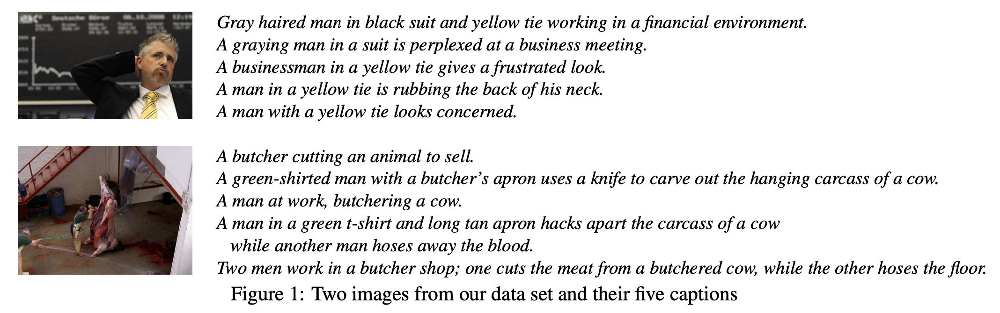

# Flickr30K

## Data Features

## Data Example



## Download Links

NA

## Download Script

We use [kaggle](https://www.kaggle.com/datasets/hsankesara/flickr-image-dataset?resource=download) to download the flickr30k images.

```shell
cd Flickr30k
pip install kaggle
kaggle config set -n path -v /path/to/your/kaggle.json
kaggle datasets download -d hsankesara/flickr-image-dataset -p "./"
unzip flickr-image-dataset.zip
mkdir ./images
# move flickr30k_images/flickr30k_images/flickr30k_images/* to ./images
find flickr30k_images/flickr30k_images/flickr30k_images/ -name "*.jpg" | xargs -i mv {} ./images/
# count this number of images downloaded
find ./images -type f -name "*.jpg" | grep -c '.jpg$' # 31783
# delete the redundant files
rm -rf flickr30k_images
```

- The downloaded files are structured as follows:

    ```
    Flickr30k/
    |-- [1.3K]  README.md
    |-- [8.2G]  flickr-image-dataset.zip
    `-- [1004K]  images/    # 31783 jpg images in total
    ```

## Statistics

NA

## Reference

- [Kaggle-Flickr30k](https://www.kaggle.com/datasets/hsankesara/flickr-image-dataset?resource=download)
- [Flickr30k-Homepage](http://shannon.cs.illinois.edu/DenotationGraph/)
- [Paper](https://www.google.com/search?client=safari&rls=en&q=From+image+descriptions+to+visual+denotations%3A+New+similarity+metrics+for+semantic+inference+over+event+descriptions&ie=UTF-8&oe=UTF-8)