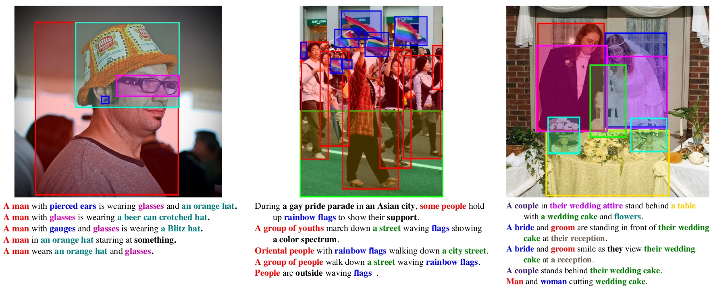
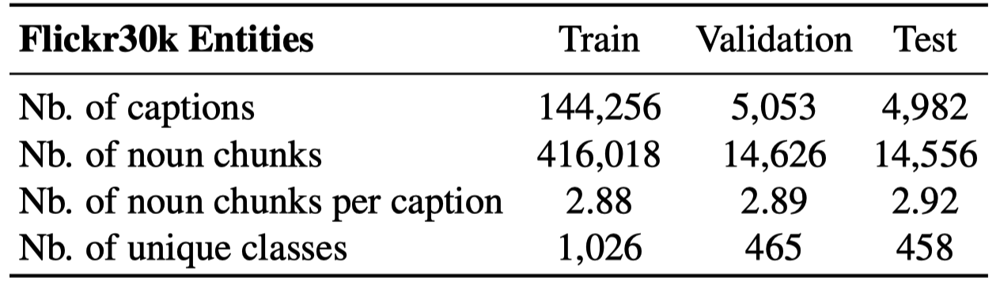

# Flickr30K Entities Dataset

Note that the Flickr30K Dataset includes images obtained from [Flickr](https://www.flickr.com/). Use of the images must abide by the [Flickr Terms of Use](http://www.flickr.com/help/terms/). We do not own the copyright of the images. They are solely provided for researchers and educators who wish to use the dataset for non-commercial research and/or educational purposes.

## Data Features

#### Coreference Chains:

Each image in the dataset has a txt file in the "Sentences" folder.  Each line of this file contains a caption with annotated phrases blocked off with brackets.  Each annotation has the following form:

    [/EN#<chain id>/<type 1>/<type 2>.../<type n> <word 1> <word 2> ... <word n>]

Phrases that belong to the same coreference chain share the same chain id.  Each phrase has one or more types associated with it, which correspond to the rough categories described in our paper.  Phrases of the type "notvisual" have the null chain id of "0" and should be considered a set of singleton coreference chains since these phrases were not annotated.


#### Bounding Boxes or Scene/No Box:

Each image in the dataset has an xml file in the "Annotations" folder which follows a similar format to the PASCAL VOC datasets.  These files have object tags which either contain a bounding box defined by xmin,ymin,xmax,ymax tags or scene/no box binary flags contained in scene and nobndbox tags.

Each object tag also contains one or more name tags which contain the chain ids the object refers to.

#### Unrelated Captions:

We have a list of the captions in the dataset that do not relate to the images themselves in the UNRELATED_CAPTIONS file.  This list is likely incomplete.

## Data Example

<div style="text-align: center;">
  
</div>

- `[/LANG#ID/ENTITY_TAG noun chunck]`

    
    ```
    [/EN#137644/people A group of friends] playing [/EN#137645/other cards] and trying to bluff [/EN#0/notvisual each other] into making [/EN#137650/other a terrible mistake] .
    [/EN#137644/people A group of college students] gathers to play [/EN#137648/other texas] hold [/EN#137651/other em] [/EN#137647/other poker] .
    [/EN#137644/people Several men] play [/EN#137645/other cards] while around [/EN#137645/other a green table] .
    [/EN#137644/people A group of several men] playing [/EN#137646/other poker] .
    [/EN#137644/people Six white males] playing [/EN#137647/other poker] .
    ```
    - For more data samples, please ref to this [markdown](./data_samples.md).

## Download Links

- [Download_link](https://github.com/BryanPlummer/flickr30k_entities)

## Download Script

```shell
cd Flickr30k_Entities
chmod +x download_datasets.sh
nohup ./download_datasets.sh >nohup.out& 2>&1
watch -n 1 tail nohup.out
```

- The downloaded files are structured as follows:

    ```
    Flickr30k_Entities/
    |-- [1004K] Annotations/        # contains xml files with bounding boxes
    |-- [1004K] Sentences/          # contains txt files with grounded captions
    |-- [5.1K]  README.md
    |-- [ 303]  UNRELATED_CAPTIONS
    |-- [ 28M]  annotations.zip
    |-- [1.0K]  download_datasets.sh
    |-- [4.3K]  flickr30k_entities_utils.py
    |-- [3.8K]  getAnnotations.m
    |-- [3.4K]  getSentenceData.m
    |-- [ 10K]  test.txt            # contains index for test set
    |-- [313K]  train.txt           # contains index for train set
    `-- [ 11K]  val.txt             # contains index for validation set
    ```

## Statistics


<div style="text-align: center;">
  
</div>

## Matlab Interface

We have included Matlab code to parse our data files.  

To extract Coreference information use the following function call:

    >> corefData = getSentenceData('<path_to_annotation_directory>/Sentences/<image id>.txt');

To extract the xml data use the following:

    >> annotationData = getAnnotations('<path_to_annotation_directory>/Annotations/<image id>.xml');
    
Please see each function for details about the structures returned from each function.

## Python Interface

The python interface to parse out data files follow the same format as the Matlab interface, except underscores were used rather than camel case.  Please see [the code's documentation](flickr30k_entities_utils.py) for further information about the provided functions.

## Reference

- [Github](https://github.com/BryanPlummer/flickr30k_entities)
- [Paper](https://arxiv.org/abs/1505.04870)