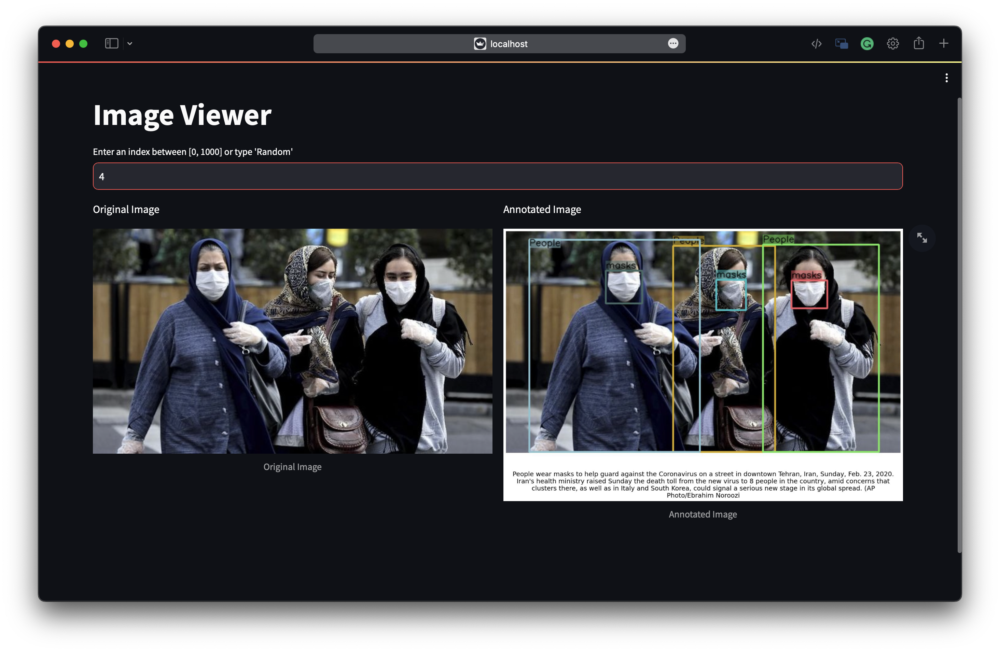

# Image Viwer

- Run the following commands to view the images:

  ```bash
  cd GRIT_20M/image_viewer
  export GRIT_20M_ANNO_DOWNLOAD_DIR="./download/grit_coyo.jsonl"
  export GRIT_20M_IMAGE_URL_TO_PATH="./download/image_url_to_path.json"
  streamlit run image_viewer.py --server.fileWatcherType none -- --path_to_ann $GRIT_20M_ANNO_DOWNLOAD_DIR --image_url_to_path $GRIT_20M_IMAGE_URL_TO_PATH --tmp_dir ./tmp --sample_num 1000
  ```

  